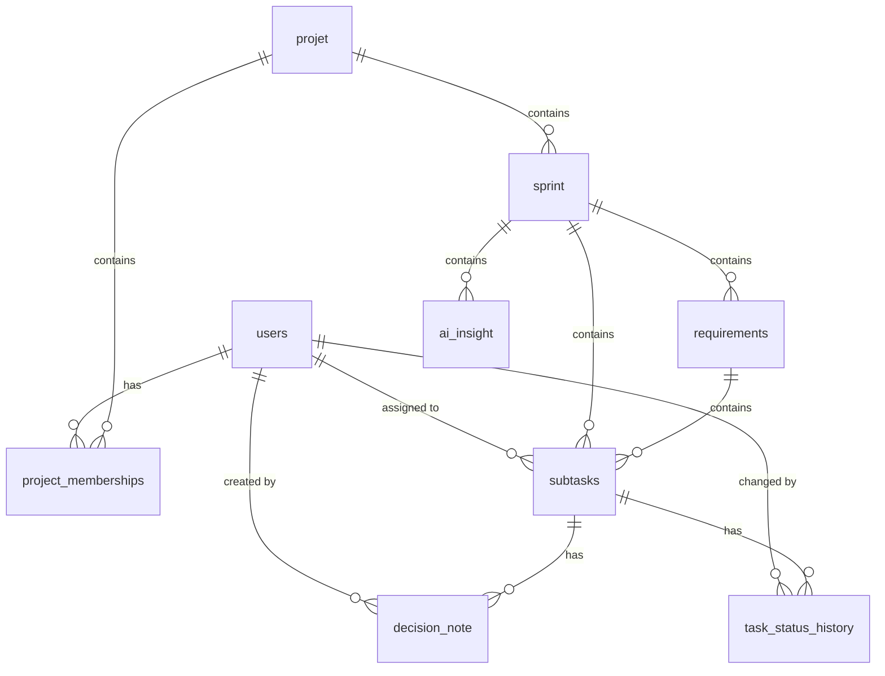

# Database Schema and Relationships

This document outlines all the database tables in the LevelUP project, their relationships, and the Java model files where they are defined.

## 1. `users`
- **File**: `backend/src/main/java/com/ehtp/kanban_backend/model/User.java`
- **Description**: Stores user account information, including roles and capacity points.
- **Relationships**:
  - **One-to-Many** with `project_memberships` (A user can be a member of multiple projects).
  - **One-to-Many** with `subtasks` (A user can be assigned to multiple tasks as an `assignee`).

## 2. `projet`
- **File**: `backend/src/main/java/com/ehtp/kanban_backend/model/Projet.java`
- **Description**: Represents a project workspace.
- **Relationships**:
  - **One-to-Many** with `sprint` (A project contains multiple sprints).
  - **One-to-Many** with `project_memberships` (A project has multiple members).

## 3. `project_memberships`
- **File**: `backend/src/main/java/com/ehtp/kanban_backend/model/ProjectMembership.java`
- **Description**: A join table mapping users to projects with specific roles (OWNER, MEMBER, VIEWER).
- **Relationships**:
  - **Many-to-One** with `users` (Belongs to a user).
  - **Many-to-One** with `projet` (Belongs to a project).

## 4. `sprint`
- **File**: `backend/src/main/java/com/ehtp/kanban_backend/model/Sprint.java`
- **Description**: Represents a sprint within a project with planned points and objectives.
- **Relationships**:
  - **Many-to-One** with `projet` (Belongs to a project).
  - **One-to-Many** with `requirements` (Contains multiple requirements).
  - **One-to-Many** with `subtasks` (Contains multiple tasks).
  - **One-to-Many** with `ai_insight` (Contains multiple AI insights).

## 5. `requirements`
- **File**: `backend/src/main/java/com/ehtp/kanban_backend/model/Requirement.java`
- **Description**: Represents a high-level requirement or user story within a sprint.
- **Relationships**:
  - **Many-to-One** with `sprint` (Belongs to a sprint).
  - **One-to-Many** with `subtasks` (Contains multiple tasks/subtasks).

## 6. `subtasks` (Tasks)
- **File**: `backend/src/main/java/com/ehtp/kanban_backend/model/Task.java`
- **Description**: Represents a task or subtask that needs to be completed.
- **Relationships**:
  - **Many-to-One** with `requirements` (Belongs to a requirement).
  - **Many-to-One** with `sprint` (Belongs to a sprint).
  - **Many-to-One** with `users` (Assigned to a user).
  - **One-to-Many** with `decision_note` (Has multiple decision notes).
  - **One-to-Many** with `task_status_history` (Has multiple status history records).

## 7. `task_status_history`
- **File**: `backend/src/main/java/com/ehtp/kanban_backend/model/TaskStatusHistory.java`
- **Description**: Tracks the history of status changes for a task.
- **Relationships**:
  - **Many-to-One** with `subtasks` (Belongs to a task).
  - **Many-to-One** with `users` (Tracks which user made the change).

## 8. `decision_note`
- **File**: `backend/src/main/java/com/ehtp/kanban_backend/model/DecisionNote.java`
- **Description**: Records decisions made regarding a specific task (what and why).
- **Relationships**:
  - **Many-to-One** with `subtasks` (Belongs to a task).
  - **Many-to-One** with `users` (Created by a user).

## 9. `ai_insight`
- **File**: `backend/src/main/java/com/ehtp/kanban_backend/model/AiInsight.java`
- **Description**: Stores AI-generated insights, risk alerts, and recommendations for a sprint.
- **Relationships**:
  - **Many-to-One** with `sprint` (Belongs to a sprint).

## 10. `sprint_metric_snapshot`
- **File**: `backend/src/main/java/com/ehtp/kanban_backend/model/SprintMetricSnapshot.java`
- **Description**: Captures a snapshot of metrics (velocity, health score) for a sprint at a given time.
- **Relationships**: 
  - *No direct foreign key relationships in JPA* (Uses `sprintId` as a basic numeric reference).

## 11. `boards`
- **File**: `backend/src/main/java/com/ehtp/kanban_backend/model/Board.java`
- **Description**: Represents a Kanban board structure.
- **Relationships**:
  - *No explicit relationships currently defined.*

---
### Entity-Relationship Diagram (Mermaid)

